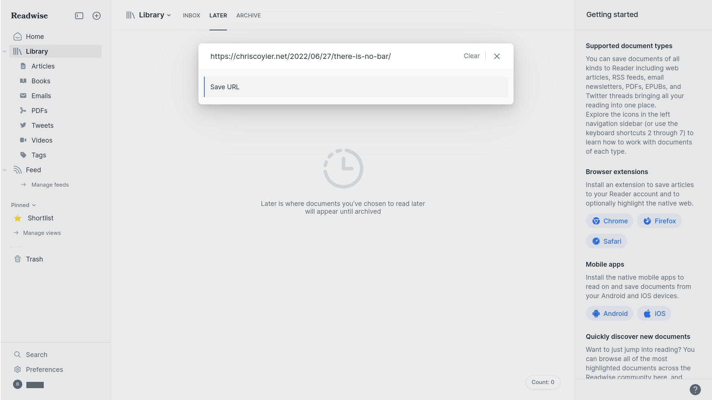
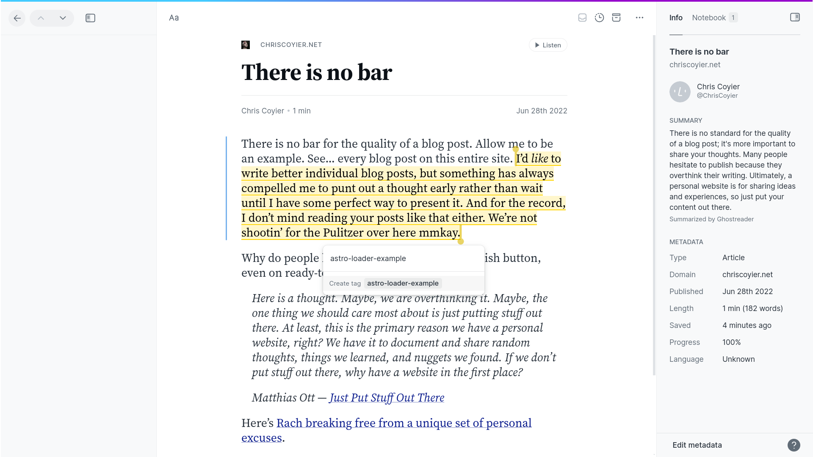
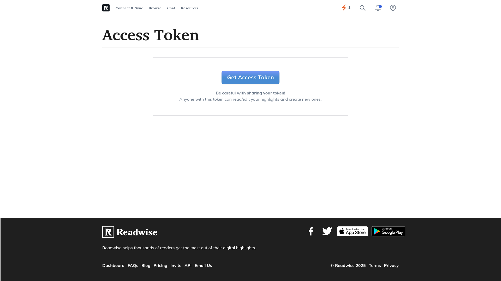

# Astro Loader for Readwise

[](https://www.npmjs.com/package/astro-loader-readwise)
[](https://github.com/baraqkamsani/astro-loader-readwise)
[](https://opensource.org/licenses/MIT)
[](https://github.com/withastro/astro)
[](https://www.npmjs.com/package/astro-loader-readwise)
[](https://bundlephobia.com/package/astro-loader-readwise)

Load
[Readwise highlights](https://readwise.io/)
for
[Astro's content loader](https://docs.astro.build/en/reference/content-loader-reference/).

1. [Usage](#usage)

   1. [Add tags to your Readwise highlights](#add-tags-to-your-readwise-highlights)

      1. [Save a new URL to Readwise Reader](#save-a-new-url-to-readwise-reader)

      2. [Create a highlight with a tag](#create-a-highlight-with-a-tag)

      3. [Get your Readwise Access Token](#get-your-readwise-access-token)

   2. [Use the loader in your Astro project](#use-the-loader-in-your-astro-project)

   3. [Test the results of the loader](#test-the-results-of-the-loader)

2. [Options](#options)

   1. [READWISE_ACCESS_TOKEN](#readwise_access_token)

   2. [filterTags](#filtertags)

   3. [omitHighlightKeys](#omithighlightkeys)

   4. [omitBookKeys](#omitbookkeys)

3. [References](#references)

## Usage

### Add tags to your Readwise highlights

In this example, we will create a tagged highlight from the following article:

[chriscoyier.net/2022/06/27/there-is-no-bar](https://chriscoyier.net/2022/06/27/there-is-no-bar/)

#### Save a new URL to Readwise Reader

<picture>
	<source
		media="(prefers-color-scheme: dark)"
		srcset="images/01-readwise-reader-save-url-dark.png"
	>
	
</picture>

#### Create a highlight with a tag

<picture>
	<source
		media="(prefers-color-scheme: dark)"
		srcset="images/02-readwise-reader-highlight-tag-dark.png"
	>
	
</picture>

#### Get your Readwise Access Token

Go to [readwise.io/access_token](https://readwise.io/access_token):

<picture>
	
</picture>

You can save your access token in a private `.env` file.

### Use the loader in your Astro project

Add
[astro-loader-readwise](https://github.com/baraqkamsani/astro-loader-readwise)
to your project:

```sh
npm install astro-loader-readwise
```

Use it in your collection config file:

```ts
// src/content.config.ts
import { defineCollection } from 'astro:content';
import { readwiseLoader } from 'astro-loader-readwise';

const readwiseHighlights = defineCollection({
  loader: readwiseLoader({
    READWISE_ACCESS_TOKEN: import.meta.env.READWISE_ACCESS_TOKEN
    filterTags: [
      'astro-loader-example'
    ]
  })
});

export const collections = { readwiseHighlights };
```

### Test the results of the loader

Create an
[endpoint](https://docs.astro.build/en/guides/endpoints/#static-file-endpoints)
to display the content collection:

```ts
// src/pages/astro-loader-readwise.json.ts
import type { APIRoute } from 'astro';
import { getCollection } from 'astro:content';
const highlightsCollection = await getCollection('readwiseHighlights');
const highlightsJSON = JSON.stringify(highlightsCollection);

export const GET: APIRoute = () => {
  return new Response(highlightsJSON, {
    headers: { 'Content-Type': 'application/json' }
  });
};
```

Run the development server:

1. `npx astro dev --port 4321`

2. From the browser,
   go to
   [localhost:4321/astro-loader-readwise.json](http://localhost:4321/astro-loader-readwise.json)

While some fields have been shortened to keep things concise, \
you can expect results comparable to the following:

```json
[{

"id": "987654321",

"data": {
  "text":
    "I’d *like* to write better individual blog posts, but something has always compelled me to punt out a thought early rather than wait until I have some perfect way to present it. And for the record, I don’t mind reading your posts like that either. We’re not shootin’ for the Pulitzer over here mmkay.",

  "id":              987654321,
  "is_deleted":      false,
  "note":            "",
  "location":        4567,
  "location_type":   "offset",
  "highlighted_at":  "2025-02-08T12:00:00.000Z",
  "created_at":      "2025-02-08T11:59:30.000Z",
  "updated_at":      "2025-02-08T12:00:00.020Z",
  "external_id":     "01abc000000000000000000000",
  "end_location":    null,
  "url":             "https://read.readwise.io/read/01abc000000000000000000000",
  "tags": [
    {
      "id": 191919191,
      "name": "astro-loader-example"
    }
  ],
  "is_favorite": false,
  "is_discard": false,
  "readwise_url": "https://readwise.io/open/987654321",
  "color": "",
  "book": {
    "title":           "There Is No Bar",
    "readable_title":  "There Is No Bar",
    "author":          "Chris Coyier",
    "source_url":      "https://chriscoyier.net/2022/06/27/there-is-no-bar/",
    "asin":            null,
    "book_tags":       [],
    "category":        "articles",
    "cover_image_url": "https://i0.wp.com/.../Frame-1.png?fit=1200%2C1200&ssl=1",
    "document_note":   null,
    "is_deleted":      false,
    "readwise_url":    "https://readwise.io/bookreview/12345678",
    "source":          "reader",
    "summary":         "There is no standard for the quality of a blog post; ...",
    "unique_url":      "https://read.readwise.io/read/02def000000000000000000000",
    "user_book_id":    12345678
  },
  "book_id": 12345678
},

"collection": "readwiseHighlights"

}]
```

## Options

### READWISE_ACCESS_TOKEN

Required. Your Readwise API access token.

```ts
readwiseLoader({
  READWISE_ACCESS_TOKEN: import.meta.env.READWISE_ACCESS_TOKEN // Required
})
```

### filterTags

Array of tags to filter highlights by. \
Only highlights containing at least one of these tags will be loaded.

```ts
readwiseLoader({
  filterTags: ['astro-loader'] // Default: ['astro-loader']
})
```

### omitHighlightKeys

Array of keys to omit from highlight objects. \
Useful for server-rendered routes if you don't need certain fields.

```ts
readwiseLoader({
  omitHighlightKeys: [
    'created_at',
    'updated_at',
    'is_deleted'
    'note'
    'location'
    'location_type'
    'created_at'
    'updated_at'
    'external_id'
    'end_location'
    'url'
    'is_favorite'
    'is_discard'
    'readwise_url'
    'color'
    'book_id'
  ]
  // Default: []
})
```

### omitBookKeys

Array of keys to omit from book objects. \
Defaults to [ 'highlights' ] to prevent duplicate data.

```ts
readwiseLoader({
  omitBookKeys: ['highlights', 'summary'] // Default: ['highlights']
})
```

## Suggested Approach

1. Use a dedicated highlight tag for all highlights you intend to fetch with the loader

2. If you have several pages using Readwise highlights of varying tags,
   filter them with flatMap:

   ```ts
   // src/pages/quotes/frontend.json.ts
   import type { APIRoute } from 'astro';
   import { getCollection } from 'astro:content';
   const filter = [
     // We want to keep highlights that match any of these tags,
     // with the prerequisite that they also contain the tags
     // specified in our loader's `filterTags`.
     'css',
     'html',
     'javascript',
   ];

   export const GET: APIRoute = async () => {
     const highlights = await getCollection('readwiseHighlights');
     const filtered = highlights.flatMap(entry => {
       const hasFilterTags = entry.data.tags?.some(tag => filter.includes(tag.name));
       return hasFilterTags
         ? [entry] // Keep
         : [];     // Remove
     });

     return new Response(JSON.stringify(filtered), {
       headers: { 'Content-Type': 'application/json' }
     });
   };
   ```

## Roadmap

- [ ] Identify nullable fields from Readwise API
- [ ] Provide subset schema for common use-cases
- [ ] Minimal demo on GitHub pages
  - [ ] Test equality for pre-rendered json endpoint with expected output

## References

- [Readwise API](https://readwise.io/api_deets)
- [Astro Docs - Content Collections](https://docs.astro.build/en/guides/content-collections/)
- [Astro Docs - Content Collections API Reference](https://docs.astro.build/en/reference/modules/astro-content/)
- [Astro Docs - Using Environment Variables](https://docs.astro.build/en/reference/environment-variables/)
- [Astro Docs - Environment Variables API Reference](https://docs.astro.build/en/reference/modules/astro-env/)
- [Vite Docs - Env Variables and Modes](https://vite.dev/guide/env-and-mode)
- [Zod Documentation](https://zod.dev/)
